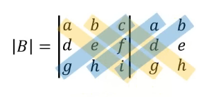

# Determinan Matriks

Misal diketahui determinan matriks *A*. Bisa ditulis __det A__ ataupun *|A|*

> Determinan matriks hanya ada pada matriks persegi ya

# Pencarian determinan Ordo 2 * 2
Cara mencarinya cukup gampang, kita tinggal mengkali-silangkan elemen pada diagonal utama lalu mengurangkan keduanya.

$$
A = \begin{pmatrix} 
a & b \\ 
c & d 
\end{pmatrix}
$$

Melalui hasil tersebut dapat disimpulkan bahwa rumus pencahariannya adalah seperti berikut:

$$
|A| = ad - bc
$$

# Pencarian determinan Ordo 3 * 3
Kita akan menggunakan metode __SARRUS__. Nilai determinan dihitung dengan menjumlahkan hasil kali elemen pada tiga diagonal menurun, lalu menguranginya dengan total hasil kali elemen pada tiga diagonal menaik.

Sebagai contoh, kita diberikan sebuah matriks $B$ sebagai berikut.

$$
B = \begin{pmatrix}
a & b & c \\
d & e & f \\
g & h & i
\end{pmatrix}
$$

Pada awal, kita akan menambahkan kolom 1 dan 2 pada samping matriks. Secara visual, susunan Metode Sarrus akan terlihat seperti ini:

$$
|B| = \begin{vmatrix}
a & b & c \\
d & e & f \\
g & h & i
\end{vmatrix}
\begin{matrix}
a & b \\
d & e \\
g & h
\end{matrix}
$$

Berikut visualisasi perkalian silangnya:

- __Garis kuning:__ Kalikan elemennya lalu jumlahkan.
- __Garis biru:__ Kalikan elemennya lalu jumlahkan. 

Hasil akhirnya adalah total garis kuning dikurangi total garis biru.

Dengan ini, maka rumus mencari determinannya adalah seperti ini:

$$
|B| = aei + bfg + cdh - ceg - afh - bdi 
$$

Bisa juga disederhanakan menjadi seperti ini:

$$
|B| = (aei + bfg + cdh) - (ceg + afh + bdi) 
$$

