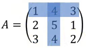
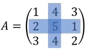

# Minor, Kofaktor, dan Adjoin

> Ini adalah materi syarat untuk materi berikutnya yaitu inverse matriks.

## Pengenalan Minor

Minor adalah determinan dari sub-matriks yang tersisa setelah baris ke-$i$ dan kolom ke-$j$ dihapus dari matriks asal. 

Misal kita diberi tugas mencari $M_{ij}$. 
- $M$: Simbol untuk menyatakan minor.
- $i$: Simbol untuk menyatakan baris yang akan dihapus.
- $j$: Simbol untuk menyatakan kolom yang akan dihapus.

#### Mencari Minor
Sebagai contoh kita memiliki matriks $A$:

$$
A = 
\begin{pmatrix} 
1 & 4 & 3 \\
2 & 5 & 1 \\
3 & 4 & 2
\end{pmatrix}
$$

Kita ingin mencari $M_{12}$ (minor dari baris 1 kolom 2). Langkah pertama adalah menghapus baris 1 dan kolom 2 dari matriks tersebut.

Dengan ini kita mendapatkan matriks berikut

$$
M_{12} = 
\begin{pmatrix} 
2 & 1 \\
3 & 2
\end{pmatrix}
$$

Sekarang kita hanya perlu mencari determinannya untuk mendapatkan minor dari matriks tersebut.

$$
M_{12} = 
\begin{vmatrix} 
2 & 1 \\
3 & 2
\end{vmatrix}
= (2 \cdot 2) - (3 \cdot 1)
= 4 - 3
= 1
$$

Ok sekali lagi, kali ini akan mencari $M_{22}$. Pertama kita hapus baris 2 kolom 2

Lalu kita cari determinan dari submatriks yang tersisa
$$
M_{22} = 
\begin{vmatrix} 
1 & 3 \\
3 & 2
\end{vmatrix}
= 2 - 9
= -7
$$

## Pengenalan Kofaktor

Kita sudah mengenal apa itu minor, lalu apa itu __kofaktor__? Kofaktor simpelnya adalah nilai matriks yang sudah diberi "arah" atau tanda (positif atau negatif) berdasarkan posisi baris dan kolomnya. Jika minor hanya menghitung besaran angka dari sub-matriks, maka Kofaktor memastikan besaran tersebut mengikuti keseimbangan matriks.

Kofaktor ini memiliki fungsi yang sangat krusial, ini disebabkan karena banyak operasi aljabar linear yang membutuhkan kofaktor. Sebagai contoh, kofaktor ini adalah bahan baku wajib untuk mencari invers matriks.

Secara visual, pola tanda kofaktor matriks selalu berselang-seling seperti papan catur (*checkerboard*). Berikut contohnya untuk berbagai ukuran matriks

Ini untuk matriks 3x3 

$$
\begin{bmatrix}
+ & - & + \\
- & + & - \\
+ & - & +
\end{bmatrix}
$$

Dan ini untuk matrix 4x4

$$
\begin{bmatrix}
+ & - & + & - \\
- & + & - & + \\
+ & - & + & - \\
- & + & - & +
\end{bmatrix}
$$

Sebagai contoh, mari kita membuat kofaktor menggunakan matriks $A$ pada contoh sebelumnya.

$$
A = 
\begin{pmatrix} 
1 & 4 & 3 \\
2 & 5 & 1 \\
3 & 4 & 2
\end{pmatrix}
$$

Berarti kita akan mencari besaran minor setiap elemennya terlebih dahulu.
$$
kof (A) =
\begin{pmatrix}
M_{11} & -M_{12} & M_{13} \\
-M_{21} & M_{22} & -M_{23} \\
M_{31} & -M_{32} & M_{33} \\
\end{pmatrix} = 
\begin{pmatrix}
6 & -1 & -7 \\
4 & -7 & 8 \\
-11 & 5 & -3
\end{pmatrix}
$$

Bisa dilihat bahwa kofaktor ini hanyalah sebuah matriks hasil dari minor dari berbagai minor, yang kemudian diarahkan apakah posisinya negatif maupun positif.

> Q: Gimana kalau aku mau tau isi kofaktor baris i dan kolom j tanpa harus ngitung satu-satu minor matriksnya?

Bisa pakai rumus ini

$$C_{ij} = (-1)^{i+j} \cdot M_{ij}$$

Jadi elemen dari kofaktor ini juga dapat disimbolkan dengan angka $C$

## Pengenalan Adjoin

Sama seperti kofaktor, adjoin ini juga menjadi bahan baku utama untuk melakukan invers matriks. Lalu ada apa dengan adjoin? 

Adjoin secara sedernahana adalah hasil transpose dari kofaktor suatu matriks

$$
Adj(A) = (kof(A))^T
$$

Maka dari itu untuk mencari Adjoin kita wajib untuk mencari kofaktor terlebih dahulu. Transpose sendiri dapat kita lakukan dengan membalikkan (menswap) posisi dari baris dan kolom dari setiap elemen dari matriks. 

$$
kof(A) =
\begin{pmatrix}
6 & -1 & -7 \\
4 & -7 & 8 \\
-11 & 5 & -3
\end{pmatrix}
$$

$$
Adj(A) = (kof(A))^T =
\begin{pmatrix} 
6 & 4 & -11 \\ 
-1 & -7 & 5 \\ 
-7 & 8 & -3 
\end{pmatrix}
$$

Bisa dilihat seperti pada contoh diatas misal hasil minor dari $M_{12}$ kini dipindahkan ke baris ke-2 kolom ke-1 (nilainya tidak diubah, hanya posisinya saja).

